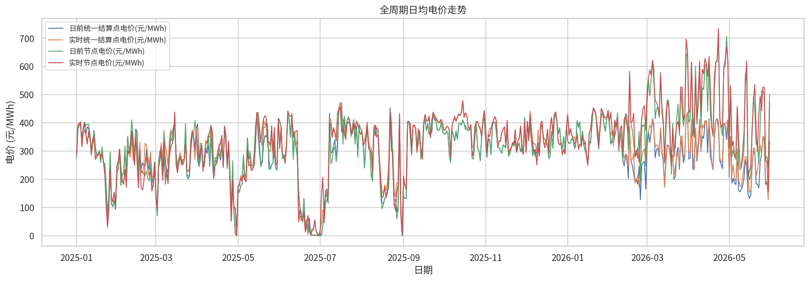
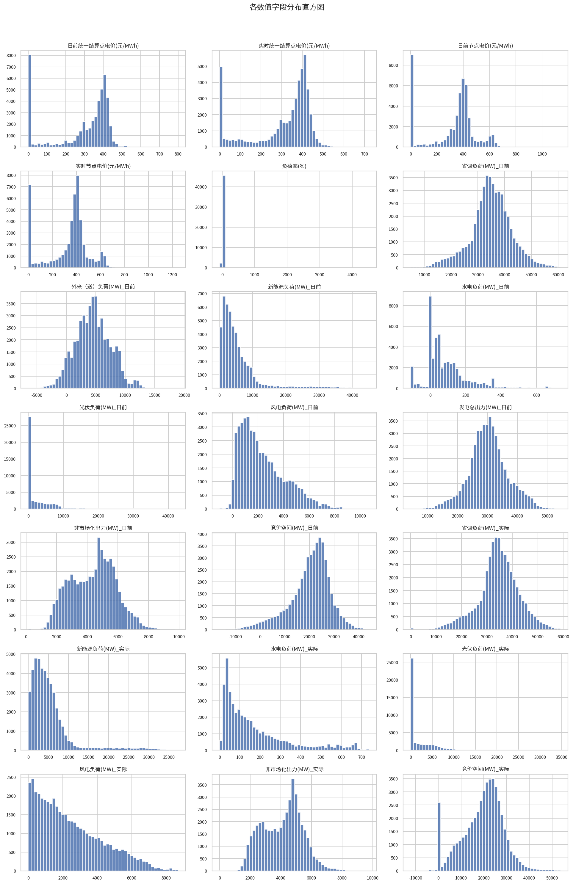
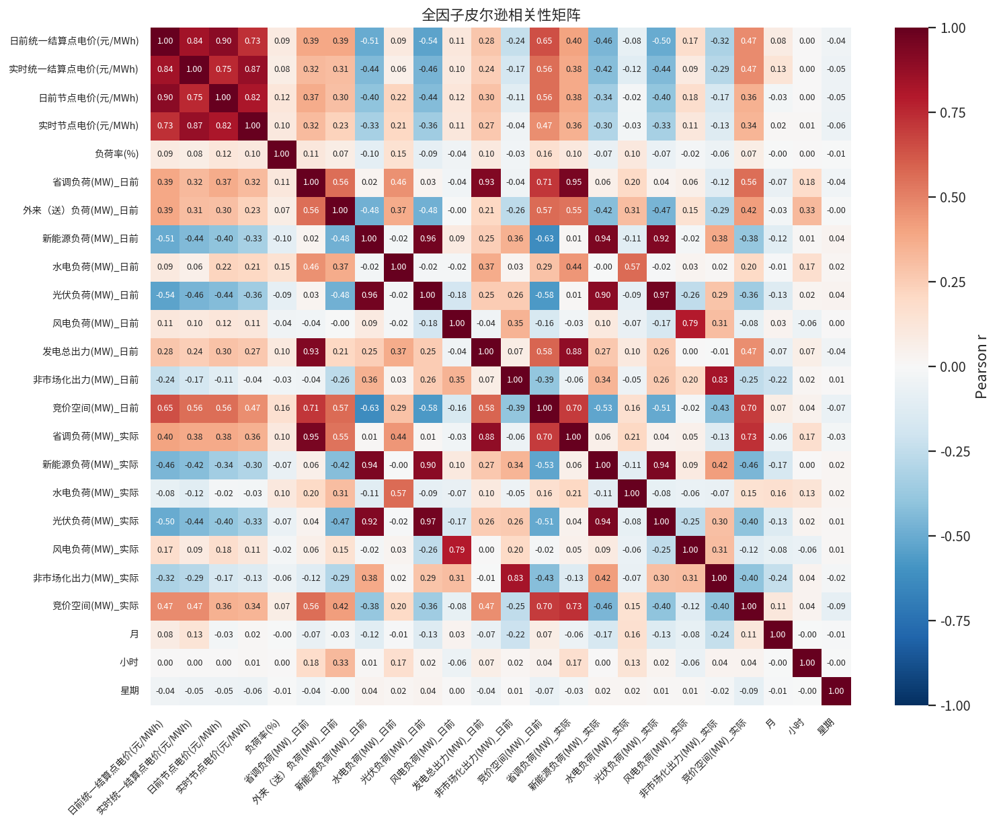
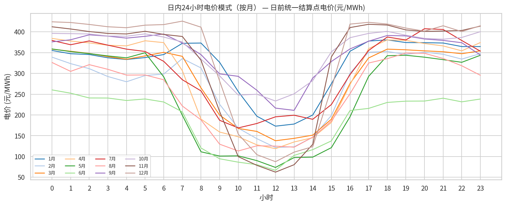
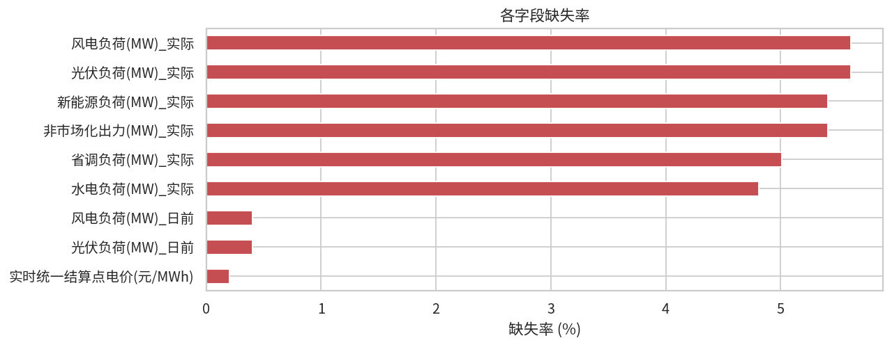
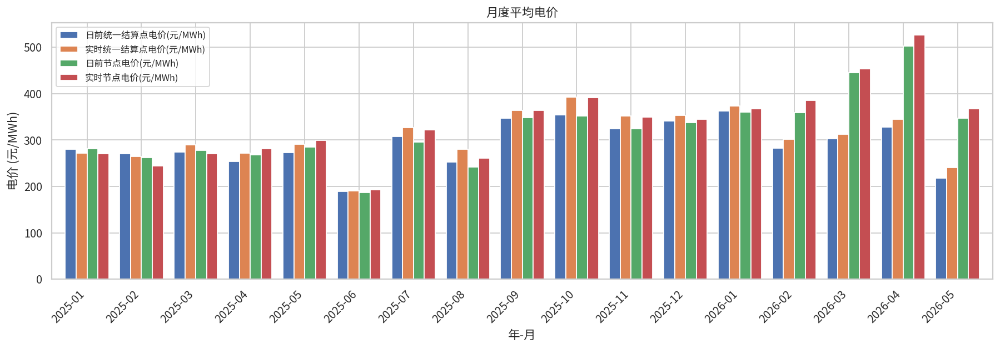
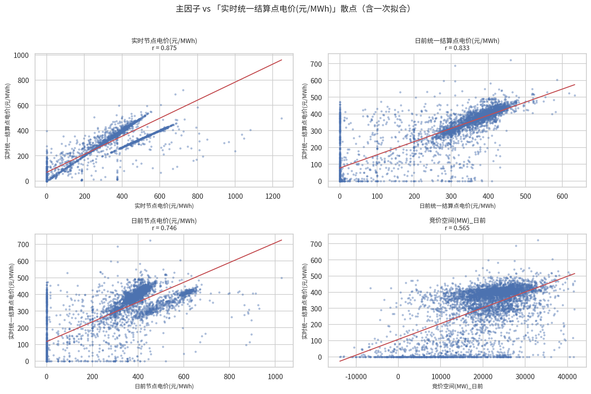
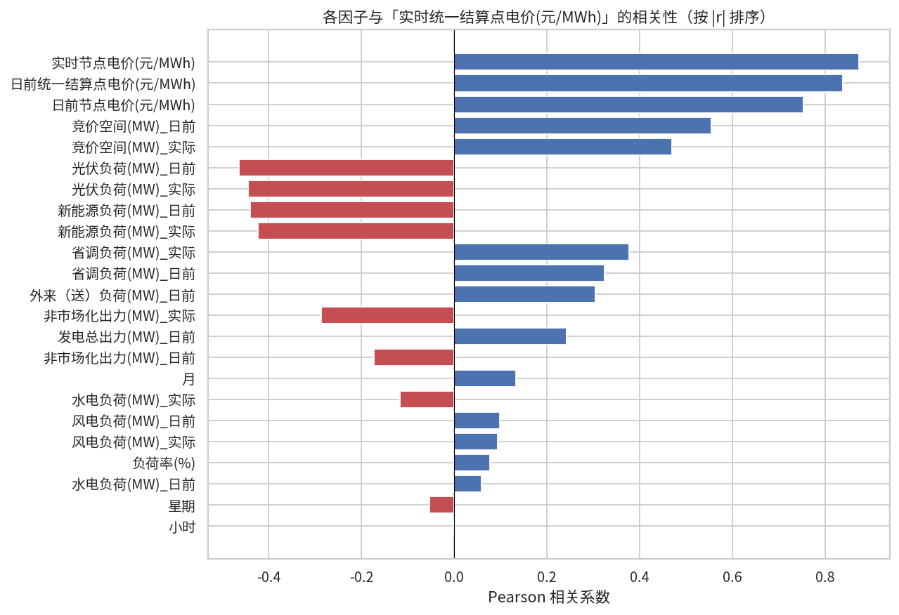
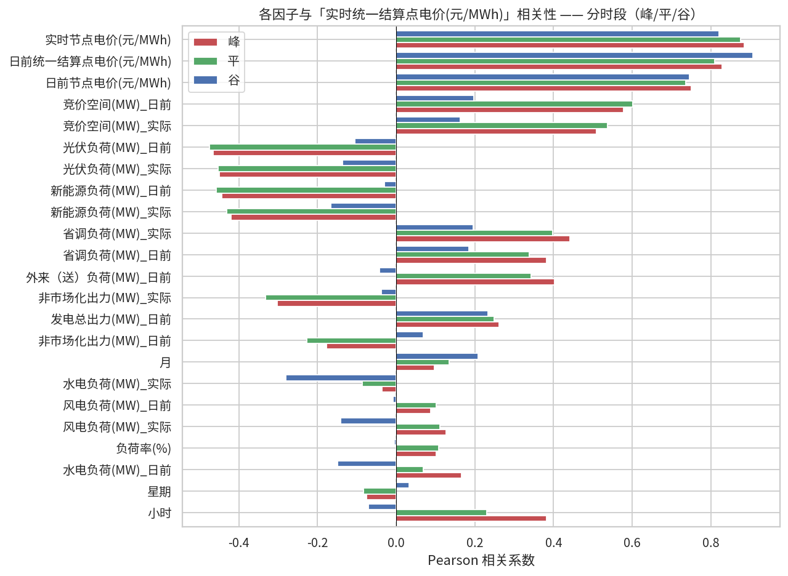

# 电力市场数据分析报告

**数据目录**: `/data/ztwen2/project_dir/pingwei_data_analyser/2025-2026市场情况`  
**时间范围**: 2025-01-01 00:15:00 ~ 2026-05-31 00:00:00  
**样本规模**: 47,904 行 × 33 列  
**分析目标**: `实时统一结算点电价(元/MWh)`

---
## 一、数据概况

**覆盖月份**: 17 个月  
`2025-01, 2025-02, 2025-03, 2025-04, 2025-05, 2025-06, 2025-07, 2025-08, 2025-09, 2025-10, 2025-11, 2025-12, 2026-01, 2026-02, 2026-03, 2026-04, 2026-05`

### 缺失率 Top 10

| 字段 | 缺失率 (%) |
|------|----------:|
| 风电负荷(MW)_实际 | 5.61 |
| 光伏负荷(MW)_实际 | 5.61 |
| 新能源负荷(MW)_实际 | 5.41 |
| 非市场化出力(MW)_实际 | 5.41 |
| 省调负荷(MW)_实际 | 5.01 |
| 水电负荷(MW)_实际 | 4.81 |
| 风电负荷(MW)_日前 | 0.40 |
| 光伏负荷(MW)_日前 | 0.40 |
| 实时统一结算点电价(元/MWh) | 0.20 |

---
## 二、关键字段描述统计

|                            |   count |     mean |     std |       min |   median |      max |
|:---------------------------|--------:|---------:|--------:|----------:|---------:|---------:|
| 日前统一结算点电价(元/MWh) |   47904 |   292.15 |  154.13 |      0    |   360.2  |   800    |
| 实时统一结算点电价(元/MWh) |   47808 |   307.28 |  144.79 |      0    |   369.24 |   722.79 |
| 日前节点电价(元/MWh)       |   47904 |   322.36 |  184.78 |      0    |   380.8  |  1138.5  |
| 实时节点电价(元/MWh)       |   47904 |   335.11 |  180.24 |      0    |   386    |  1246.5  |
| 负荷率(%)                  |   47904 |    65.17 |  144.81 |    -82.07 |    64.9  |  4524.98 |
| 省调负荷(MW)_日前          |   47904 | 34914.7  | 7701.81 |   4867.69 | 35000    | 60880    |
| 新能源负荷(MW)_日前        |   47904 |  5610.5  | 6283.72 |     57.81 |  3799.94 | 45090.2  |
| 水电负荷(MW)_日前          |   47904 |    87.81 |  122.43 |   -111    |    56    |   736.14 |
| 光伏负荷(MW)_日前          |   47712 |  3285.13 | 6381.1  |      0    |    58.28 | 42816.6  |
| 风电负荷(MW)_日前          |   47712 |  2355.8  | 1752.51 |  -1015.72 |  1908.02 | 10717.4  |
| 发电总出力(MW)_日前        |   47904 | 30352.4  | 6521.44 |   4250.69 | 30204    | 54418    |
| 非市场化出力(MW)_日前      |   47904 |  4394.19 | 1467.63 |    151.58 |  4554.27 |  9935.66 |
| 竞价空间(MW)_日前          |   47904 | 20259.9  | 8274.86 | -16462.7  | 21630.5  | 44306.3  |
| 省调负荷(MW)_实际          |   45504 | 34630.2  | 7902.29 |      0    | 34714.9  | 58904.7  |
| 新能源负荷(MW)_实际        |   45312 |  5259.71 | 5295.91 |      0    |  4028.18 | 37286.7  |
| 水电负荷(MW)_实际          |   45600 |   169.09 |  161.18 |      0    |   114.08 |   738.59 |
| 光伏负荷(MW)_实际          |   45216 |  2826.14 | 5450.49 |     -0.01 |    49.63 | 34710.1  |
| 风电负荷(MW)_实际          |   45216 |  2439.6  | 1856.75 |      0    |  2023.35 |  8698.31 |
| 非市场化出力(MW)_实际      |   45312 |  4114.67 | 1290.6  |      0    |  4297.46 |  9778.91 |
| 竞价空间(MW)_实际          |   47904 | 19592.9  | 8996.56 | -12151.5  | 20859.2  | 53665.4  |

---
## 三、电价相关性分析（皮尔逊 r）

**目标变量**: `实时统一结算点电价(元/MWh)`

| 因子 | r | 方向 | 强度 |
|------|------:|:----:|:----:|
| 实时节点电价(元/MWh) | 0.873 | ➕ 正 | 🔴 强 |
| 日前统一结算点电价(元/MWh) | 0.839 | ➕ 正 | 🔴 强 |
| 日前节点电价(元/MWh) | 0.754 | ➕ 正 | 🔴 强 |
| 竞价空间(MW)_日前 | 0.555 | ➕ 正 | 🟠 中 |
| 竞价空间(MW)_实际 | 0.470 | ➕ 正 | 🟠 中 |
| 光伏负荷(MW)_日前 | -0.464 | ➖ 负 | 🟠 中 |
| 光伏负荷(MW)_实际 | -0.444 | ➖ 负 | 🟠 中 |
| 新能源负荷(MW)_日前 | -0.440 | ➖ 负 | 🟠 中 |
| 新能源负荷(MW)_实际 | -0.422 | ➖ 负 | 🟠 中 |
| 省调负荷(MW)_实际 | 0.378 | ➕ 正 | 🟡 弱 |
| 省调负荷(MW)_日前 | 0.325 | ➕ 正 | 🟡 弱 |
| 外来（送）负荷(MW)_日前 | 0.305 | ➕ 正 | 🟡 弱 |
| 非市场化出力(MW)_实际 | -0.287 | ➖ 负 | 🟡 弱 |
| 发电总出力(MW)_日前 | 0.243 | ➕ 正 | 🟡 弱 |
| 非市场化出力(MW)_日前 | -0.173 | ➖ 负 | ⚪ 极弱 |
| 月 | 0.133 | ➕ 正 | ⚪ 极弱 |
| 水电负荷(MW)_实际 | -0.116 | ➖ 负 | ⚪ 极弱 |
| 风电负荷(MW)_日前 | 0.098 | ➕ 正 | ⚪ 极弱 |
| 风电负荷(MW)_实际 | 0.093 | ➕ 正 | ⚪ 极弱 |
| 负荷率(%) | 0.077 | ➕ 正 | ⚪ 极弱 |
| 水电负荷(MW)_日前 | 0.059 | ➕ 正 | ⚪ 极弱 |
| 星期 | -0.053 | ➖ 负 | ⚪ 极弱 |
| 小时 | 0.001 | ➕ 正 | ⚪ 极弱 |

---
## 四、分时段（峰/平/谷）相关性对比

|                            |     峰 |     平 |     谷 |
|:---------------------------|-------:|-------:|-------:|
| 小时                       |  0.383 |  0.23  | -0.07  |
| 星期                       | -0.075 | -0.083 |  0.032 |
| 水电负荷(MW)_日前          |  0.167 |  0.069 | -0.149 |
| 负荷率(%)                  |  0.102 |  0.108 | -0.004 |
| 风电负荷(MW)_实际          |  0.126 |  0.111 | -0.141 |
| 风电负荷(MW)_日前          |  0.088 |  0.102 | -0.008 |
| 水电负荷(MW)_实际          | -0.036 | -0.086 | -0.279 |
| 月                         |  0.097 |  0.134 |  0.209 |
| 非市场化出力(MW)_日前      | -0.177 | -0.226 |  0.069 |
| 发电总出力(MW)_日前        |  0.261 |  0.249 |  0.234 |
| 非市场化出力(MW)_实际      | -0.301 | -0.332 | -0.037 |
| 外来（送）负荷(MW)_日前    |  0.403 |  0.343 | -0.042 |
| 省调负荷(MW)_日前          |  0.382 |  0.339 |  0.185 |
| 省调负荷(MW)_实际          |  0.442 |  0.397 |  0.196 |
| 新能源负荷(MW)_实际        | -0.42  | -0.431 | -0.166 |
| 新能源负荷(MW)_日前        | -0.444 | -0.457 | -0.029 |
| 光伏负荷(MW)_实际          | -0.449 | -0.453 | -0.136 |
| 光伏负荷(MW)_日前          | -0.466 | -0.475 | -0.104 |
| 竞价空间(MW)_实际          |  0.508 |  0.537 |  0.163 |
| 竞价空间(MW)_日前          |  0.577 |  0.602 |  0.197 |
| 日前节点电价(元/MWh)       |  0.75  |  0.736 |  0.745 |
| 日前统一结算点电价(元/MWh) |  0.829 |  0.809 |  0.907 |
| 实时节点电价(元/MWh)       |  0.885 |  0.875 |  0.821 |

---
## 五、电价预测专业解读

1. **推升电价的主要因子**: **实时节点电价(元/MWh)** (r=0.87), **日前统一结算点电价(元/MWh)** (r=0.84), **日前节点电价(元/MWh)** (r=0.75)  
   这些因子上升通常伴随系统供需偏紧或负荷上行，电价随之走高。

2. **抑制电价的主要因子**: **光伏负荷(MW)_日前** (r=-0.46), **光伏负荷(MW)_实际** (r=-0.44), **新能源负荷(MW)_日前** (r=-0.44)  
   新能源/水电出力增加挤占火电边际机组，结算点价格趋于回落。

3. **日内电价模式**: 高点出现在 **0 时**，低点在 **12 时**，呈现典型双峰/单谷型负荷特征。

4. **峰谷差异**: 光伏负荷(MW)_日前 对电价的相关性在峰段为 r=-0.47，谷段为 r=-0.10；  
   差异显示新能源对峰时段挤压更明显，谷时段影响有限（谷时段光伏几乎不出力）。

5. **月度波动**: 均价范围 **190.4 ~ 392.2** 元/MWh，  
   最高出现在 **2025-10**，最低出现在 **2025-06**。

---
## 六、可视化图表

### daily

### distributions

### heatmap

### hourly

### missing

### monthly

### scatter

### with_target

### with_target_seg

---
*报告结束*